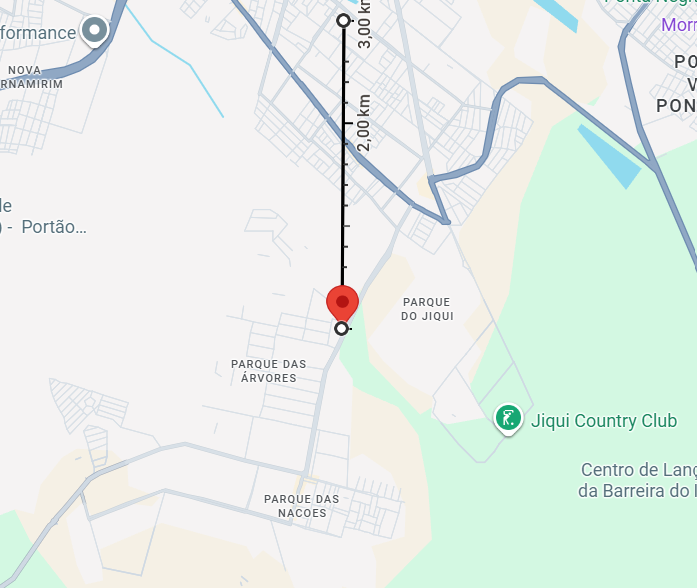
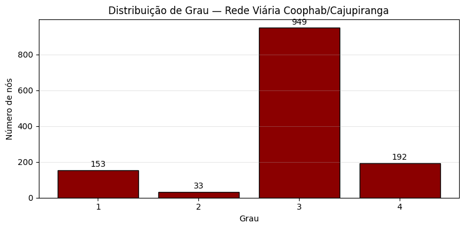
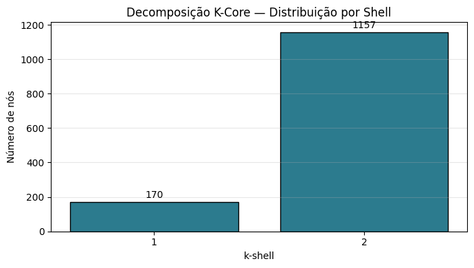
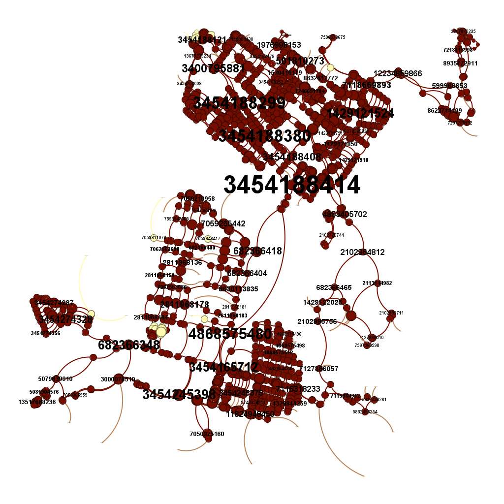
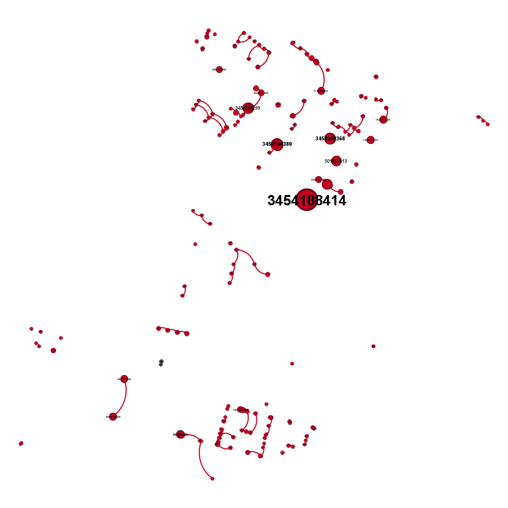
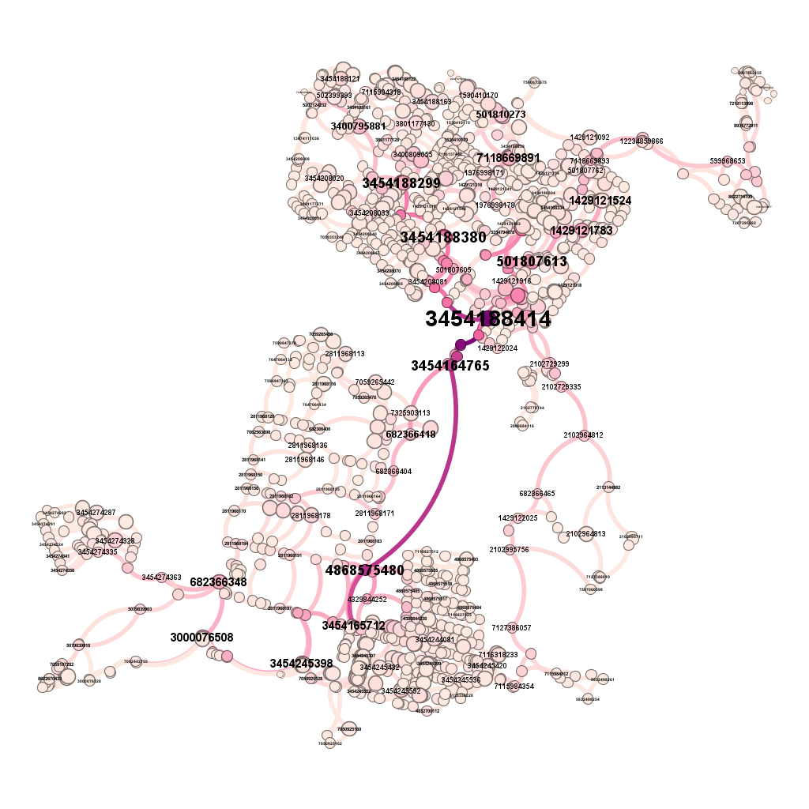
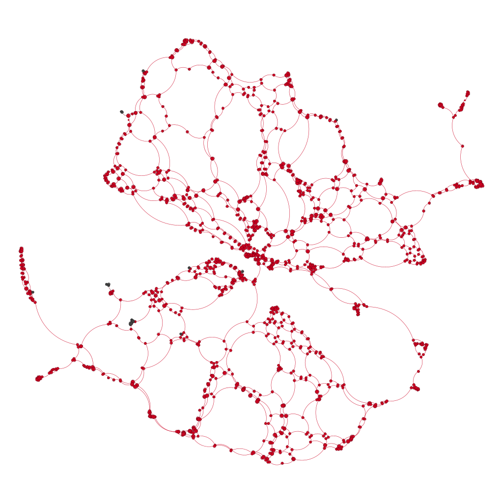

# Análise Estrutural da Malha Viária de Coophab e Cajupiranga

**Trabalho Prático — Unidade 2 — Algoritmos e Estrutura de Dados II (DCA3702)**
**Universidade Federal do Rio Grande do Norte (UFRN) — 2026.1**
**Professor:** Ivanovitch Silva

**Autores:** Matheus Fernandes e Thales Varela

🎥 **Vídeo de apresentação (Loom):** `https://www.loom.com/share/5e25a52f840a405caeb1a2c910760cb0`

---

## 1. Região Analisada

A área de estudo são os bairros de **Coophab e Cajupiranga**, no município de **Parnamirim/RN**, extraídos do OpenStreetMap em um raio de **3 km** ao redor do ponto central **(-5.908906, -35.205872)**, próximo ao Parque das Árvores.

<p align="center">
  
</p>

> Mapa da região analisada — pino indica o ponto central (-5.908906, -35.205872), com escala de 3 km marcada à direita. A área abrange Nova Parnamirim (norte), Parque das Árvores, Parque das Nações, Coophab/Cajupiranga (sul), além do Parque do Jiqui e Jiqui Country Club a leste.

A região foi escolhida pelo conhecimento prévio do grupo sobre a dinâmica de trânsito local, com destaque para:
- contraste entre os "silos" de condomínios fechados (Green Club 2, Morumbi) e as vias arteriais;
- presença da **Avenida Olavo Montenegro** como divisor estrutural entre Nova Parnamirim (ao norte) e o agrupamento Coophab/Cajupiranga/Parque das Árvores (ao sul);
- existência do Parque do Jiqui (APA — Área de Proteção Ambiental) a leste, criando um vazio estrutural natural;
- contraste entre malha planejada em quadras regulares (Parque das Árvores, Parque das Nações) e áreas de loteamentos fechados de baixa permeabilidade.

A combinação dessas características gera uma malha com volume ideal de dados (1327 nós, 1917 arestas) e topologia rica para a análise.

---

## 2. Objetivo

> Identificar e caracterizar os elementos estruturais mais importantes da malha viária de Coophab e Cajupiranga utilizando métricas de grafos (grau, betweenness, closeness e k-core), e interpretar como diferentes perspectivas analíticas (geográfica vs estrutural) revelam aspectos complementares da realidade urbana.

---

## 3. Metodologia

Pipeline em três etapas:

```
OSMnx ─► NetworkX ─► Gephi
```

1. **Extração** (OSMnx) — Download da rede viária real do OpenStreetMap com `graph_from_point(ponto, dist=3000, network_type="drive")`.
2. **Análise** (NetworkX) — Conversão para grafo não-direcionado e simples (sem multi-arestas), cálculo de centralidades e decomposição k-core.
3. **Visualização** (Gephi) — Exportação para GraphML e produção de quatro visualizações: geográfica completa, top 10% por grau, k-core (k=2), e estrutural via ForceAtlas2.

### Escolhas metodológicas relevantes

- **Grafo simples (`G_simples = nx.Graph(G_undirected)`):** todas as métricas são calculadas sobre o grafo simples para garantir que "grau" represente o número de vizinhos únicos. A diferença para o MultiGraph foi de 4 arestas paralelas — pequena, mas suficiente para distorcer cálculos se ignorada.
- **Validação de conectividade:** antes do cálculo de closeness, verificou-se `nx.is_connected(G_simples) == True` (1 componente). Sem essa garantia, a métrica seria mal definida.
- **Sem peso nas arestas:** as métricas são puramente topológicas (não usam o atributo `length`). Análises ponderadas ficam como trabalho futuro.

---

## 4. Métricas Calculadas

| Métrica | Valor / Resumo |
|---|---|
| Nós (cruzamentos) | **1327** |
| Arestas (ruas) | **1917** |
| Componentes conectados | **1** |
| Grau mínimo / médio / máximo | 1 / **2.89** / 4 |
| Grau mediano | **3** |
| Distribuição de grau | k=1: 153 (11.5%) · k=2: 33 (2.5%) · **k=3: 949 (71.5%)** · k=4: 192 (14.5%) |
| Maior k-core | **k = 2** |
| Nós no k=2 core | **1157 (87.19%)** |
| Nós periféricos (k=1) | 170 (12.81%) |
| Bridge node estrutural | **OSM ID `3454188414`** |
| Betweenness máxima | **0.4695** (no bridge node) |
| Closeness máxima | **0.0630** (no bridge node) |

### Top 10 por Betweenness (pontes estruturais)

| # | Nó OSM | Betweenness | Grau | K-Core |
|---|---|---|---|---|
| 1 | 3454188414 | 0.4695 | 4 | 2 |
| 2 | 7246531423 | 0.4434 | 3 | 2 |
| 3 | 4868575480 | 0.3584 | 3 | 2 |
| 4 | 3454164765 | 0.3418 | 3 | 2 |
| 5 | 3454164751 | 0.3205 | 3 | 2 |
| 6 | 2102755965 | 0.2395 | 3 | 2 |
| 7 | 3454165712 | 0.2270 | 3 | 2 |
| 8 | 3454188380 | 0.2180 | 4 | 2 |
| 9 | 3454188382 | 0.2161 | 4 | 2 |
| 10 | 3454208304 | 0.2147 | 3 | 2 |

**Observação chave:** 7 dos 10 nós mais centrais têm grau 3, não 4 — confirmando que posição vence quantidade de conexões locais.

---

## 5. Principais Visualizações

### 5.1 Distribuição de Grau



A modal é grau 3 (71.5%), refletindo o predomínio de T-intersections em loteamentos planejados. O grau 2 é raro (2.5%) porque o OSMnx remove nós lineares intermediários durante a simplificação.

### 5.2 Decomposição K-Core



87.19% dos nós pertencem ao k=2 core (esqueleto cíclico). Os 12.81% restantes são cul-de-sacs, ramais terminais e silos de condomínios fechados. Não existem subgrafos com k≥3.

### 5.3 Visualização Geográfica Completa



Layout: **Geo Layout** (Scale = 500.000) usando latitude/longitude reais.
Encoding: tamanho ~ grau, cor ~ core_number, label ~ betweenness.
Mostra a malha viária real preservando a geografia.

### 5.4 Top 10% por Grau



Filtro: Intervalo de Grau [4, 4] (195 nós, 14.7% — não exatamente 10% por causa da natureza discreta dos graus em rede viária).
Encoding: tamanho ~ betweenness (já que todos os nós têm grau 4, o tamanho diferencia importância global entre os hubs).
**O super-hub `3454188414` aparece dominante no centro.**

### 5.5 K-Core (k=2)



Filtro: K-core k=2 (1157 nós, 87.19%).
Encoding: tamanho ~ grau, cor ~ betweenness (gradiente).
Os "tentáculos" da V1 sumiram — só sobrou o esqueleto cíclico robusto.

### 5.6 Visualização Estrutural (ForceAtlas2)



Layout: **ForceAtlas2** (sem geografia).
**Achado mais revelador do trabalho:** mesmo sem coordenadas, o layout topológico recuperou a divisão norte/sul, mostrando duas mega-comunidades ligadas por um pescoço fino. O bridge node `3454188414` está exatamente nesse pescoço — confirmação matemática de que a separação Coophab vs Nova Parnamirim não é apenas geográfica, é estrutural.

> Versão com labels disponível em [`imagens/visualizacao_estrutural_labels.png`](imagens/visualizacao_estrutural_labels.png).

---

## 6. Respostas às Questões Obrigatórias

### Q1 — Os nós com maior grau coincidem com os nós de maior betweenness?

**Não.** A interseção entre o Top 10 por grau e o Top 10 por betweenness foi **0 nós em comum**. Existem duas causas estruturais:

1. **Saturação do grau:** com 192 nós empatados em grau 4, o "Top 10 por grau" é essencialmente arbitrário.
2. **Posição > conexões:** 7 dos 10 nós mais centrais por betweenness têm grau 3 (não 4). Estão em corredores arteriais entre bairros, não em cruzamentos internos complexos.

O nó `3454188414` é exceção única: combina grau 4 + maior betweenness + posição no pescoço estrutural.

### Q2 — O núcleo identificado pelo k-core coincide com os principais hubs?

**Não totalmente.** O k=2 core contém 1157 nós (87.19%), enquanto os hubs (top 10% grau) são 195. Quase todos os hubs estão no k-core, mas a maioria dos nós no k-core são cruzamentos comuns de grau 2-3. **K-core captura robustez topológica (ciclos); grau captura complexidade local — são complementares, não redundantes.**

### Q3 — O que a métrica de betweenness revela que o grau não revela?

O grau é **local** (vizinhos imediatos), a betweenness é **global** (importância nos caminhos mínimos da rede inteira). Em rede planar com grau saturado em 4, o grau perde discriminação. A betweenness revela que **alguns cruzamentos são desproporcionalmente importantes** porque são únicos caminhos entre regiões — o nó `3454188414` tem betweenness ~10x maior que o 10º colocado, mesmo todos tendo o mesmo grau de muitos outros nós.

### Q4 — O que muda entre análise geográfica e análise estrutural?

A **geográfica** preserva o reconhecimento espacial (bairros, vias, parques) mas pode mascarar comunidades topológicas. A **estrutural** (ForceAtlas2) abandona coordenadas e revela a topologia pura. **Achado-chave:** o ForceAtlas2 recuperou a divisão geográfica norte/sul sem usar coordenadas — duas mega-comunidades ligadas pelo bridge node `3454188414`. **Topologia e geografia coincidem, validando matematicamente uma separação que parecia apenas visual.**

### Q5 — Existem regiões críticas para mobilidade urbana?

**Sim, em três níveis:**
1. **Bridge node único** `3454188414` — interdição compromete conexão Nova Parnamirim ↔ Coophab/Cajupiranga.
2. **Corredor de alta betweenness** — espinha dorsal entre as duas comunidades, visível como caminhos destacados na Visualização 3.
3. **Silos vulneráveis** — 170 nós fora do k=2 core, concentrados em condomínios fechados (Green Club 2, Morumbi) com poucas vias de acesso.

### Q6 — A rede parece homogênea ou apresenta concentração estrutural?

**Mista: homogeneidade local + concentração global.**
- Métricas locais (grau, k-core) são uniformes — sem super-hubs no sentido scale-free.
- Métricas globais (betweenness) variam ordens de magnitude, e a topologia se divide em duas comunidades.
- **Consequência prática:** ataques aleatórios à rede têm pouco efeito; ataques dirigidos aos nós de alta betweenness são devastadores.

### Q7 — Os resultados fazem sentido considerando o conhecimento urbano da região?

**Sim, completamente.**
- Divisão topológica norte/sul ↔ separação física Nova Parnamirim vs Coophab/Cajupiranga.
- Grau máximo 4 ↔ ausência de viadutos e cruzamentos multinível.
- Ausência de k≥3 ↔ sem hubs de transporte multimodal na região.
- Lado leste esvaziado ↔ Parque do Jiqui (APA) e Country Club.
- Silos com baixa conectividade ↔ condomínios fechados (Green Club 2, Morumbi).
- "Tentáculos" sudoeste ↔ estradas vicinais visíveis no Maps.

---

## 7. Principais Conclusões

1. **Bridge node `3454188414`** é o nó mais crítico da rede — grau 4, maior betweenness, maior closeness, membro do k=2 core, e posição no pescoço estrutural revelado pelo ForceAtlas2.

2. **Grau é uma métrica saturada em redes viárias planares.** Com 192 nós empatados em grau 4, ela perde poder discriminativo. **Betweenness e core_number são complementos essenciais.**

3. **Posição importa mais que conexões locais.** A maioria dos nós com maior betweenness têm grau 3, não 4 — estão em corredores arteriais, não em interseções complexas.

4. **Topologia recupera geografia.** O ForceAtlas2 reconstruiu a divisão norte/sul sem usar coordenadas, provando que a separação entre as comunidades é estrutural.

5. **87% da rede é topologicamente robusta** (k=2 core), 13% é vulnerável (cul-de-sacs e silos de condomínios fechados).

6. **Aplicações práticas:** a metodologia subsidia planejamento de mobilidade urbana, gestão de risco, comparação entre bairros e resposta a emergências.

### Limitações

- Direção das vias não considerada (uso de grafo não-direcionado);
- Distâncias reais (`length`) ignoradas — métricas são puramente topológicas;
- Sem dados de tráfego ou capacidade real das vias;
- Snapshot temporal único do OpenStreetMap.

---

## 8. Estrutura do Repositório

```
projeto_T1U2_AED2/
├── README.md                                  ← este arquivo
├── T1U2_AED2.ipynb                            ← notebook completo (executável no Colab)
├── rede_coophab_gephi_final.graphml           ← grafo exportado para Gephi
└── imagens/
    ├── regiao_estudo.png                      ← mapa da região analisada (Google Maps)
    ├── distribuicao_grau.png                  ← histograma de grau (Python)
    ├── distribuicao_kcore.png                 ← distribuição k-shell (Python)
    ├── visualizacao_geografica.png            ← V1: geográfica completa (Gephi)
    ├── visualizacao_top10grau.png             ← V2: top 10% por grau (Gephi)
    ├── visualizacao_kcore.png                 ← V3: k-core k=2 (Gephi)
    ├── visualizacao_estrutural.png            ← V4: ForceAtlas2 sem labels (Gephi)
    └── visualizacao_estrutural_labels.png     ← V4 (alternativa) com labels
```

---

## 9. Como Reproduzir

1. **Notebook:** abra `T1U2_AED2.ipynb` no Google Colab e execute todas as células em ordem. O notebook é autocontido — instala `osmnx` automaticamente.
2. **Visualizações Gephi:** baixe o [Gephi](https://gephi.org/), instale o plugin **GeoLayout** e abra `rede_coophab_gephi_final.graphml`. Layouts utilizados: Geo Layout (Scale=500.000) e ForceAtlas2 (LinLog, Gravidade=1, Escala=10, Prevenir sobreposição ao final).

---

## 10. Referências

- Coscia, M. *The Atlas for the Aspiring Network Scientist*. networkatlas.eu
- Newman, M. *Networks: An Introduction*. Oxford University Press.
- Boeing, G. (2017). *OSMnx: New methods for acquiring, constructing, analyzing, and visualizing complex street networks*. Computers, Environment and Urban Systems, 65, 126-139.
- Material da disciplina: https://github.com/ivanovitchm/datastructure
